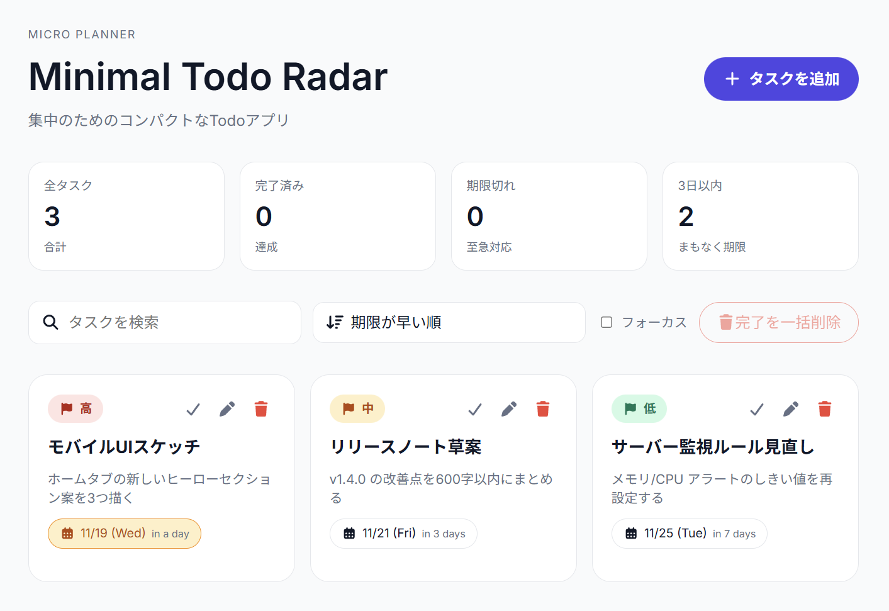

# Minimal Todo Radar

優先度と期限だけに集中できる、最小構成のTodoアプリです。

## コンセプト・主要機能

- 優先度と期限、内容をカードで可視化
- 思考を分断しないシンプルなUI
- 検索・4種類のソートに加え、「フォーカス」フィルターで今すぐやるべきものを把握
- ヘッダーのステータスチップで全体進捗と期限切れ・3日以内の圧力を常時可視化
- 完了済み一括削除ボタン

## 着想と工夫

- **背景**: 重要なタスク、今やるべきタスクをすぐに見れるようにしたかった。
- **ニーズ**: 「今日～3日以内」「優先度が高い/要注視」だけが分かれば十分という前提でUI/UXを設計。優先度の高いものと期限が近いもののみを表示する「フォーカス」フィルターを実装。完了済みは即座に消したい、という個人的な後片付け癖から完了済み一括削除ボタンを追加。
- **意識した工夫**:
	- 全てを1画面内に収め、余白と角丸で紙のダッシュボード感を演出
	- dayjs + relative time で期限を「M/D (曜)」+「relative string」にし、頭での再計算を不要に

## 使用技術 / 開発メモ

- フロントエンド: React 19 + TypeScript 5.9 + Vite 7 (SWC)
- UI: CSS (Inter フォント) + Font Awesome、レスポンシブは clamp と grid/flex を併用
- ユーティリティ: dayjs (relativeTime), uuid, localStorage persistence, custom hooks-less state構成
- 品質: ESLint 9 / TypeScript strict, npm scripts (`dev`, `build`, `lint`, `preview`)

制作時間：20時間

## ライセンス

MIT License

Copyright (c) 2025 OMU-Haruki

Permission is hereby granted, free of charge, to any person obtaining a copy
of this software and associated documentation files (the "Software"), to deal
in the Software without restriction, including without limitation the rights
to use, copy, modify, merge, publish, distribute, sublicense, and/or sell
copies of the Software, and to permit persons to whom the Software is
furnished to do so, subject to the following conditions:

The above copyright notice and this permission notice shall be included in all
copies or substantial portions of the Software.

THE SOFTWARE IS PROVIDED "AS IS", WITHOUT WARRANTY OF ANY KIND, EXPRESS OR
IMPLIED, INCLUDING BUT NOT LIMITED TO THE WARRANTIES OF MERCHANTABILITY,
FITNESS FOR A PARTICULAR PURPOSE AND NONINFRINGEMENT. IN NO EVENT SHALL THE
AUTHORS OR COPYRIGHT HOLDERS BE LIABLE FOR ANY CLAIM, DAMAGES OR OTHER
LIABILITY, WHETHER IN AN ACTION OF CONTRACT, TORT OR OTHERWISE, ARISING FROM,
OUT OF OR IN CONNECTION WITH THE SOFTWARE OR THE USE OR OTHER DEALINGS IN THE
SOFTWARE.